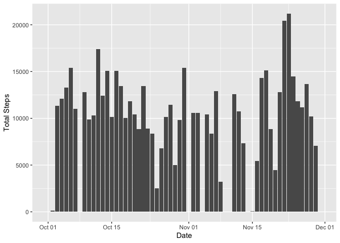
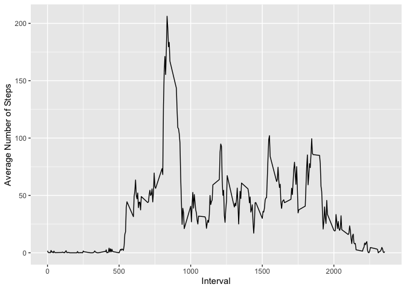
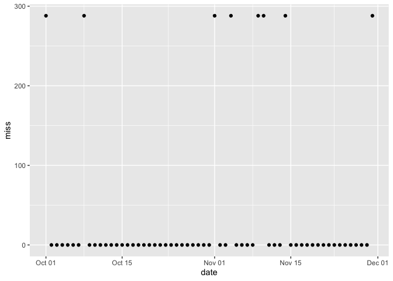
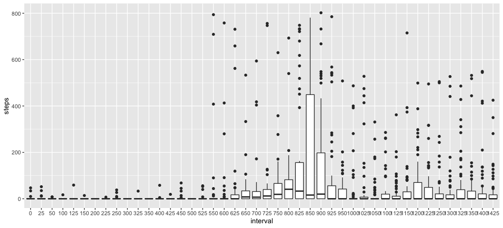
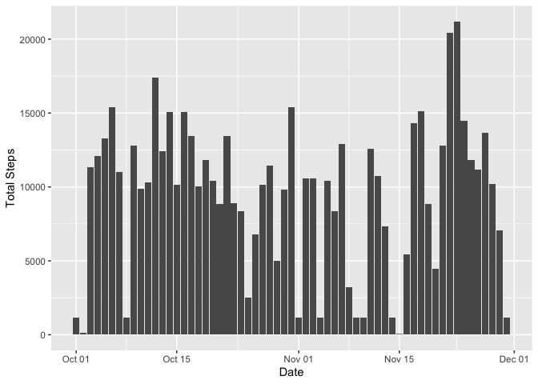
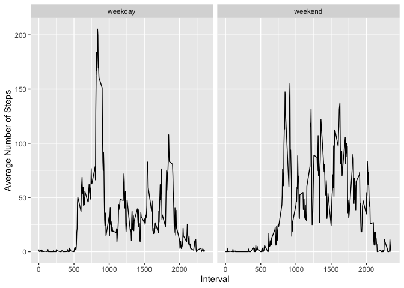

```r
library(knitr)

opts_chunk$set(fig.path = "figures/")
```


## Loading and preprocessing the data

Here, I load the relevant packages and use the "read_csv" function to import the data.


```r
library(tidyverse)
```

```
## ── Attaching packages ─────────────────────────────────────── tidyverse 1.3.0 ──
```

```
## ✓ ggplot2 3.3.3     ✓ purrr   0.3.4
## ✓ tibble  3.1.0     ✓ dplyr   1.0.5
## ✓ tidyr   1.1.3     ✓ stringr 1.4.0
## ✓ readr   1.4.0     ✓ forcats 0.5.1
```

```
## ── Conflicts ────────────────────────────────────────── tidyverse_conflicts() ──
## x dplyr::filter() masks stats::filter()
## x dplyr::lag()    masks stats::lag()
```

```r
library(lubridate)
```

```
## 
## Attaching package: 'lubridate'
```

```
## The following objects are masked from 'package:base':
## 
##     date, intersect, setdiff, union
```

```r
activity <- 
    read_csv("activity.csv")
```

```
## 
## ── Column specification ────────────────────────────────────────────────────────
## cols(
##   steps = col_double(),
##   date = col_date(format = ""),
##   interval = col_double()
## )
```


## What is mean total number of steps taken per day?

1. Total number of steps taken per day


```r
activity %>%
    group_by(date) %>%
    summarize(tot_steps = sum(steps, na.rm = TRUE))
```

```
## # A tibble: 61 x 2
##    date       tot_steps
##    <date>         <dbl>
##  1 2012-10-01         0
##  2 2012-10-02       126
##  3 2012-10-03     11352
##  4 2012-10-04     12116
##  5 2012-10-05     13294
##  6 2012-10-06     15420
##  7 2012-10-07     11015
##  8 2012-10-08         0
##  9 2012-10-09     12811
## 10 2012-10-10      9900
## # … with 51 more rows
```

2. Histogram of total number of steps taken per day


```r
activity %>%
    group_by(date) %>%
    summarize(tot_steps = sum(steps, na.rm = TRUE)) %>%
    ggplot(aes(date, tot_steps)) + geom_col() +
    xlab("Date") + ylab("Total Steps")
```

<!-- -->

3. Mean and median of total number of steps taken per day


```r
activity %>%
    group_by(date) %>%
    summarize(mean = mean(steps, na.rm = TRUE),
              median = median(steps, na.rm = TRUE))
```

```
## # A tibble: 61 x 3
##    date          mean median
##    <date>       <dbl>  <dbl>
##  1 2012-10-01 NaN         NA
##  2 2012-10-02   0.438      0
##  3 2012-10-03  39.4        0
##  4 2012-10-04  42.1        0
##  5 2012-10-05  46.2        0
##  6 2012-10-06  53.5        0
##  7 2012-10-07  38.2        0
##  8 2012-10-08 NaN         NA
##  9 2012-10-09  44.5        0
## 10 2012-10-10  34.4        0
## # … with 51 more rows
```


## What is the average daily activity pattern?

1. Time series plot of interval (x-axis) and average number of steps(y-axis)


```r
activity %>%
    group_by(interval) %>%
    summarize(avg_steps = mean(steps, na.rm = TRUE)) %>%
    ggplot(aes(interval, avg_steps)) +
    geom_line() +
    xlab("Interval") + ylab("Average Number of Steps")
```

<!-- -->

2. Interval with largest average number of steps


```r
activity %>%
    group_by(interval) %>%
    summarize(avg_steps = mean(steps, na.rm = TRUE)) %>%
    arrange(desc(avg_steps)) %>%
    `[`(1,)
```

```
## # A tibble: 1 x 2
##   interval avg_steps
##      <dbl>     <dbl>
## 1      835      206.
```


## Imputing missing values

1. Total number of missing values in the dataset


```r
activity %>%
    filter(is.na(steps)) %>%
    nrow()
```

```
## [1] 2304
```

2. Strategy for imputing missing values

Only eight days have missing values, and those days have all values missing.


```r
activity %>%
    group_by(date) %>%
    summarize(miss = sum(is.na(steps))) %>%
    ggplot(aes(date, miss)) + geom_point()
```

<!-- -->

```r
activity %>%
    group_by(date) %>%
    summarize(n())
```

```
## # A tibble: 61 x 2
##    date       `n()`
##    <date>     <int>
##  1 2012-10-01   288
##  2 2012-10-02   288
##  3 2012-10-03   288
##  4 2012-10-04   288
##  5 2012-10-05   288
##  6 2012-10-06   288
##  7 2012-10-07   288
##  8 2012-10-08   288
##  9 2012-10-09   288
## 10 2012-10-10   288
## # … with 51 more rows
```

Because the missing values are not isolated observations, we cannot impute theem by averaging the values of neighboring observations. We could potentially impute them by averaging across the values of the same intervals on the other days.

Distributions of each interval are typically situated around zero steps, with every interval having serious outliers.


```r
less_int <- 
    seq(from = 0, by = 25, length.out = length(unique(activity$interval)) / 5)

activity %>%
    filter(interval %in% less_int) %>%
    mutate(interval = factor(interval)) %>%
    ggplot(aes(interval, steps)) + geom_boxplot()
```

```
## Warning: Removed 352 rows containing non-finite values (stat_boxplot).
```

<!-- -->

3. Create new dataset with missing values filled in

Imputing using the mean would likely distort the data. We will impute using the median instead.


```r
act_imp <- 
    activity %>%
        group_by(interval) %>%
        mutate(median = median(steps, na.rm = TRUE),
               steps = if_else(is.na(steps), median, steps)) %>%
        select(-median)
```

4. Histogram of total number of steps taken each day and report mean and median of total number of steps taken each day


```r
act_imp %>%
    group_by(date) %>%
    summarize(tot_steps = sum(steps)) %>%
    ggplot(aes(date, tot_steps)) + geom_col() +
    xlab("Date") + ylab("Total Steps")
```

<!-- -->

```r
act_imp %>%
    group_by(date) %>%
    summarize(mean = mean(steps),
              median = median(steps))
```

```
## # A tibble: 61 x 3
##    date         mean median
##    <date>      <dbl>  <dbl>
##  1 2012-10-01  3.96       0
##  2 2012-10-02  0.438      0
##  3 2012-10-03 39.4        0
##  4 2012-10-04 42.1        0
##  5 2012-10-05 46.2        0
##  6 2012-10-06 53.5        0
##  7 2012-10-07 38.2        0
##  8 2012-10-08  3.96       0
##  9 2012-10-09 44.5        0
## 10 2012-10-10 34.4        0
## # … with 51 more rows
```

The new histogram is nearly identical to the earlier histogram except that the eight days that originally had missing values are now represented in the plot. Similarly, the mean and median of those eight days now have defined values.

## Are there differences in activity patterns between weekdays and weekends?

1. Create new factor variable that designates whether an observation is taken on a weekend or weekday


```r
act_imp_day <- 
    act_imp %>%
        mutate(day = wday(date),
               class = if_else(day == 7 | day == 1, "weekend", "weekday"),
               class = factor(class))

act_imp_day
```

```
## # A tibble: 17,568 x 5
## # Groups:   interval [288]
##    steps date       interval   day class  
##    <dbl> <date>        <dbl> <dbl> <fct>  
##  1     0 2012-10-01        0     2 weekday
##  2     0 2012-10-01        5     2 weekday
##  3     0 2012-10-01       10     2 weekday
##  4     0 2012-10-01       15     2 weekday
##  5     0 2012-10-01       20     2 weekday
##  6     0 2012-10-01       25     2 weekday
##  7     0 2012-10-01       30     2 weekday
##  8     0 2012-10-01       35     2 weekday
##  9     0 2012-10-01       40     2 weekday
## 10     0 2012-10-01       45     2 weekday
## # … with 17,558 more rows
```

2. Make panel time-series plot of interval (x-axis) on average number of steps (y-axis), stratified by this new factor variable


```r
act_imp_day %>%
    group_by(class, interval) %>%
    summarize(avg_steps = mean(steps)) %>%
    ggplot(aes(interval, avg_steps)) + geom_line() + facet_wrap(~class) +
    xlab("Interval") + ylab("Average Number of Steps")
```

```
## `summarise()` has grouped output by 'class'. You can override using the `.groups` argument.
```

<!-- -->
